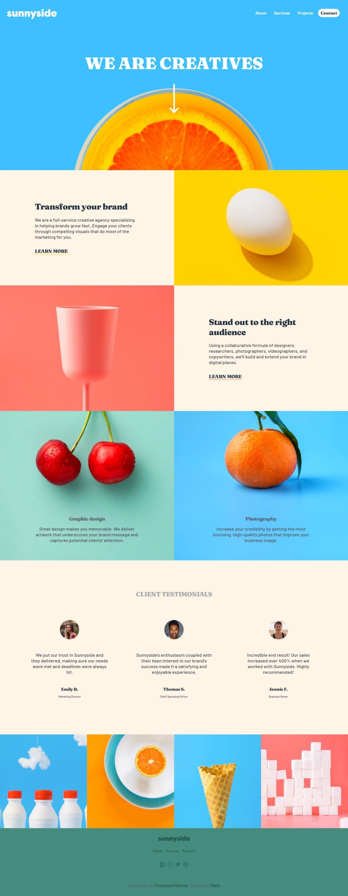

# Frontend Mentor - Sunnyside agency landing page solution

This is a solution to the [Sunnyside agency landing page challenge on Frontend Mentor](https://www.frontendmentor.io/challenges/sunnyside-agency-landing-page-7yVs3B6ef). Frontend Mentor challenges help you improve your coding skills by building realistic projects.

## Table of contents

- [Overview](#overview)
  - [The challenge](#the-challenge)
  - [Screenshot](#screenshot)
  - [Links](#links)
- [My process](#my-process)
  - [Built with](#built-with)
  - [What I learned](#what-i-learned)
  - [Continued development](#continued-development)
  - [Useful resources](#useful-resources)
- [Author](#author)

## Overview

### The challenge

Users should be able to:

- View the optimal layout for the site depending on their device's screen size
- See hover states for all interactive elements on the page

### Screenshot

### Links

- Solution URL: (https://github.com/faith5fio/Sunnyside-Agency-Landing-Page)
- Live Site URL: (https://sunnyside-agency.pages.dev/)
## My process

### Built with

- HTML5 
- CSS custom properties, Flexbox, CSS Grid
- Web-first workflow

### What I learned

- How to change svg colour on hover
- Creating a sticky navigationf with CSS and JavaScript

### Continued development

In future projects I'd like to have animation on the site

### Useful resources

- [Example resource 1] (https://css-tricks.com/snippets/css/a-guide-to-flexbox/) - This helped me get a better understanding of flexbox

## Author
- Website - [https://faith-io.pages.dev/]
- Github - [https://github.com/faith5fio]
- LinkedIn - [https://www.linkedin.com/in/faith-iyekeoretin-3973a2210]

